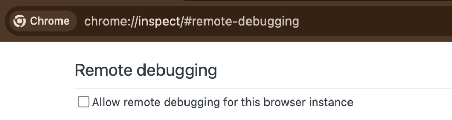

# Browser Harness ♞

The simplest, thinnest, **self-healing** harness that gives LLM **complete freedom** to complete any browser task. Built directly on CDP.

The agent writes what's missing, mid-task. No framework, no recipes, no rails. One websocket to Chrome, nothing between.

```
  ● agent: wants to upload a file
  │
  ● helpers.py → upload_file() missing
  │
  ● agent edits the harness and writes it    helpers.py   192 → 199 lines
  │                                                       + upload_file()
  ✓ file uploaded
```

**You will never use the browser again.**

## Setup prompt

Paste into Claude Code or Codex:

```text
Set up https://github.com/browser-use/browser-harness for me.

Read `install.md` first to install and connect this repo to my real browser. Then read `SKILL.md` for normal usage. Always read `helpers.py` because that is where the functions are. When you open a setup or verification tab, activate it so I can see the active browser tab. After it is installed, if I am already logged in to GitHub, star this repository as a small verification task; if I am not logged in, just go to browser-use.com.
```

When this page appears, tick the checkbox so the agent can connect to your browser:



### Windows note

- Default browser target is **Chrome**.
- On Windows, if your existing Chrome session is not exposing CDP, the harness can fall back to a dedicated isolated Chrome profile and keep going.
- Do not default to Brave unless you explicitly want Brave state or the bug only reproduces there.

Example task: `Star this repository` · see [domain-skills/](domain-skills/) for more

## Free remote browsers

Useful for sub-agents or deployment. **Free tier: 3 concurrent browsers, no card required.**

- Grab a key at [cloud.browser-use.com/new-api-key](https://cloud.browser-use.com/new-api-key)
- Or let the agent sign up itself via [docs.browser-use.com/llms.txt](https://docs.browser-use.com/llms.txt) (setup flow + challenge context included).

## How simple is it? (~592 lines of Python)

- `install.md` — first-time install and browser bootstrap
- `SKILL.md` — day-to-day usage
- `run.py` (~36 lines) — runs plain Python with helpers preloaded
- `helpers.py` (~195 lines) — starting tool calls; the agent edits these
- `admin.py` + `daemon.py` (~361 lines) — daemon bootstrap plus the CDP websocket and socket bridge

## Contributing

PRs and improvements welcome. The best way to help: **contribute a new domain skill** under [domain-skills/](domain-skills/) for a site or task you use often (LinkedIn outreach, ordering on Amazon, filing expenses, etc.). Each skill teaches the agent the selectors, flows, and edge cases it would otherwise have to rediscover.

- **Skills are written by the harness, not by you.** Just run your task with the agent — when it figures something non-obvious out, it files the skill itself (see [SKILL.md](SKILL.md)). Please don't hand-author skill files; agent-generated ones reflect what actually works in the browser.
- Open a PR with the generated `domain-skills/<site>/` folder — small and focused is great.
- Bug fixes, docs tweaks, and helper improvements are equally welcome.
- Browse existing skills (`github/`, `linkedin/`, `amazon/`, ...) to see the shape.

If you're not sure where to start, open an issue and we'll point you somewhere useful.

---

[Bitter lesson](https://browser-use.com/posts/bitter-lesson-agent-frameworks) · [Skills](https://browser-use.com/posts/web-agents-that-actually-learn)
